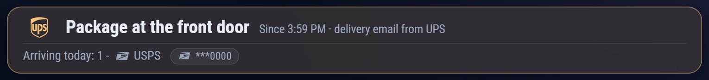

# MMM-PackageAlert

A [MagicMirror²](https://magicmirror.builders/) module that floats a slim banner over the screen when a package is at your front door or arriving today. All data comes from Home Assistant; the module holds no email or camera credentials.

## What it shows



*Sample data: a UPS delivery email set "Package at the front door", and a USPS "out for delivery"
email adds an "Arriving today" line with a masked tracking chip.*

A single glass card, pinned as an overlay just under the clock. It shows whichever of these apply and renders nothing at all (zero height, no gap) when none do.

- **Package at the front door** while the door sensor is `present`. Shows when it appeared ("Since 2:14 PM", "yesterday 9:05 PM", or a weekday or date for older ones) and the source: "doorbell camera", or "delivery email from UPS" when a carrier is known.
- **Arriving today: N - UPS, Amazon** from carrier "out for delivery" emails. Each package gets a carrier icon, and tracking numbers appear as small chips, masked by default (`***6784`). Items with no tracking number, such as many Amazon emails, are counted but have no chip.
- **A status line** only when Home Assistant cannot be used (see Troubleshooting).

When a package first appears the card gives one gentle ring pulse (about 2.6 s, not repeated, none under `prefers-reduced-motion`).

### Carrier icons

Icons come from MagicMirror's vendored Font Awesome 7 free, loaded through `font-awesome.css`. They are decorative (`aria-hidden`); the carrier name is always in the text too.

| Carrier key | Icon |
| --- | --- |
| `usps`, `ups`, `fedex`, `dhl`, `amazon` | `fa-brands` with the matching brand glyph |
| `ontrac`, `other` (and any unknown value) | `fa-solid fa-truck-fast` |
| none (detected by camera only) | `fa-solid fa-box` |

### Overlay position

The module's own region wrapper has zero height in every state, so showing or hiding the banner never moves another module. Use region `top_bar`. By default the card anchors to the bottom edge of `.module.MMM-GlassClock .glass-clock-card` plus `anchorGap` px. It follows the clock when the card resizes and when the clock module replaces the card (for example at midnight), and on window resize. If that element is not on the page it uses `fallbackTop` px from the top. Set `overlayTop` to a number to force a fixed offset, or change `anchorSelector` to anchor under a different clock. The card is at most 1000 px wide (and never wider than the screen minus 36 px), is about 90% opaque so it stays legible over other content, and sits at `z-index: 100`, so it covers whatever is beneath it.

## How detection works

Home Assistant decides what is at the door and what is arriving; the module only displays it.

- **Package delivered (door).** A Google Home scripted automation fires on the Nest `PackageDelivered` event (Nest Aware package detection) and turns on a Home Assistant `input_boolean`. That helper is exposed to Google through Home Assistant Cloud (Google Assistant). A package YAML turns the helper into `sensor.front_door_package`.
- **Carrier emails.** Home Assistant's built-in IMAP integration reads carrier mail. "Out for delivery" mail feeds the arriving list. "Delivered" mail joins the delivered list and, when the package went to the door, turns the helper on with source `email` and the carrier. Deliveries to a mailbox, parcel locker, PO box, post office or front desk are listed but do not raise the door alert.
- **No automatic removal.** Nothing detects that a package was picked up. The alert clears after a configurable timeout (the example package defaults to 12 hours, 1 to 48 via `input_number.package_alert_clear_hours`), or manually in the Home Assistant UI, or by voice ("Hey Google, turn off Package At Front Door").

## Installation

```bash
cd ~/MagicMirror/modules
git clone https://github.com/hearter20176/MMM-PackageAlert
cd MMM-PackageAlert
npm install --omit=dev
```

To update:

```bash
cd ~/MagicMirror/modules/MMM-PackageAlert
git pull
npm install --omit=dev
```

Restart MagicMirror afterwards (for example `pm2 restart <your-mm-process>`).

Requirements:

- MagicMirror² with Node.js 20 or newer (the helper uses the `ws` package, installed by `npm install`). The module uses MagicMirror's own Font Awesome 7 for icons.
- A Home Assistant instance reachable from the mirror, with a long-lived access token.
- Home Assistant Cloud (or another way to expose an entity to Google Assistant) and Nest Aware, for the doorbell path. The email path needs only a mailbox with an app password.

## Configuration

```js
{
  module: "MMM-PackageAlert",
  position: "top_bar",
  classes: "fixed_page", // MMM-pages users: show on every page
  config: {
    haUrl: "https://homeassistant.local:8123",
    haTokenFile: "/home/pi/.config/mm/ha-token", // or set PACKAGEALERT_HA_TOKEN
    showTracking: "masked",
    maxTracking: 3,
    timeFormat: 12
  }
}
```

`classes: "fixed_page"` is only meaningful with MMM-pages; omit it otherwise.

### Access token

Create a long-lived access token in Home Assistant (your profile page, Security tab). The helper resolves the token in this order:

1. `haToken` in the module config
2. the file named by `haTokenFile` (the whole file, trimmed of surrounding whitespace)
3. the `PACKAGEALERT_HA_TOKEN` environment variable

`config.js` is served to browsers, so use `haTokenFile` or the environment variable rather than `haToken`. Only the Node helper uses the token; it is never sent to the browser in a notification and never written to the log.

### Options

Defaults are taken from the module's `defaults`. The last three rows are read by the helper but are not in `defaults`; set them only if you need them.

| Option | Type | Default | Description |
| --- | --- | --- | --- |
| `haUrl` | string | `""` (required) | Base URL of Home Assistant, `http://` or `https://`. `https` connects over `wss`. |
| `haToken` | string | `""` | Long-lived access token. Visible to browsers via `config.js`; prefer `haTokenFile` or the env var. |
| `haTokenFile` | string | `""` | Path to a file containing the token. The whole file is read and trimmed. |
| `doorEntity` | string | `"sensor.front_door_package"` | Door sensor entity id. |
| `deliveriesEntity` | string | `"sensor.package_deliveries"` | Deliveries sensor entity id. |
| `showArriving` | boolean | `true` | Show the "Arriving today" line. |
| `showTracking` | string | `"masked"` | `"masked"` shows the last 4 characters (`***6784`; numbers of 4 or fewer characters become `****`), `"full"` shows the whole number, `"none"` hides tracking chips. |
| `maxTracking` | number | `3` | Most tracking chips shown; the rest collapse to "+N". |
| `timeFormat` | number | `12` | `12` or `24` hour clock for the "since" time. |
| `locale` | string | `""` | Locale for time and date text; the browser locale when empty. |
| `animationSpeed` | number | `1000` | Fade time in ms when the content changes. |
| `errorGraceSeconds` | number | `60` | How long an unreachable Home Assistant is tolerated before the status line appears. The helper reports an outage only after 3 failed attempts, so the real delay is somewhat longer. Setup errors show immediately. |
| `overlayTop` | string or number | `"auto"` | `"auto"` anchors under `anchorSelector`; a number forces that many px from the top of the screen. |
| `anchorSelector` | string | `".module.MMM-GlassClock .glass-clock-card"` | CSS selector of the element the banner sits under when `overlayTop` is `"auto"`. |
| `anchorGap` | number | `12` | Gap in px between the anchor and the banner. |
| `fallbackTop` | number | `24` | Offset in px from the top when `overlayTop` is `"auto"` and the anchor is not on the page. |
| `haAllowSelfSigned` | boolean | `false` | Accept a self-signed certificate on an `https` URL. |
| `reconnectInterval` | number | `5000` | Base reconnect delay in ms; doubles per consecutive failure, capped at 60000. |
| `heartbeatInterval` | number | `30000` | Ping interval in ms. If a ping has not been answered by the next tick, the helper drops the socket and reconnects. |

Position is set by MagicMirror's own `position` and `classes` keys, not by an option here.

## Home Assistant setup

### 1. The helper

Create a toggle helper (Settings, Devices and services, Helpers, Create helper, Toggle) named **Package At Front Door**. Its entity id should be `input_boolean.package_at_front_door`, which is what the example package expects. Do not also define it in YAML.

### 2. Expose it to Google

With Home Assistant Cloud: Settings, Home Assistant Cloud, Google Assistant, Manage entities, and enable the helper. Then link the Home Assistant action in the Google Home app (or say "Hey Google, sync my devices"). It appears in Google Home as a switch named "Package At Front Door".

### 3. The Google Home script

In the Google Home app or home.google.com, go to Automations, create a new automation and open the script editor. Paste the example below. Device names must match Google Home exactly; use the editor's autocomplete (it may show "Device name - Room name"). The script syntax follows Google's documented schema but has not been checked against every editor version, so if it rejects a line (for example `suppressFor`), follow the editor's hint.

```yaml
metadata:
  name: Package delivered at front door
  description: Turns on Package At Front Door when the doorbell detects a package delivery.

automations:
  starters:
    - type: device.event.PackageDelivered
      device: Camera - Front Door   # exact Google Home name of your Nest doorbell
      suppressFor: 2min
  actions:
    - type: device.command.OnOff
      devices: Package At Front Door
      on: true
```

Package detection needs a Nest camera or doorbell with Nest Aware.

### 4. The Home Assistant package

An example package is in this repo at `homeassistant/package_alert.yaml`. It is an example to adapt, not something Home Assistant installs for you. Copy it to `<config>/packages/package_alert.yaml` and make sure `configuration.yaml` loads packages:

```yaml
homeassistant:
  packages: !include_dir_named packages
```

Run Check configuration, then restart (or reload) Home Assistant. The example creates `sensor.front_door_package`, `sensor.package_deliveries`, `input_number.package_alert_clear_hours` (1 to 48 hours; it keeps your value across restarts, but starts at its 1-hour minimum on first load - set it to 12, or your preferred value, once after the first load), and automations that parse carrier email and auto-clear the alert. Review it before use; it references `input_boolean.package_at_front_door` and expects the sensor entity ids above.

### 5. Carrier email (optional)

The email path is inert until the IMAP integration exists.

1. In a Google account that receives carrier notifications, enable 2-step verification and create an app password.
2. In Home Assistant: Settings, Devices and services, Add integration, IMAP. Server `imap.gmail.com`, port 993, your address, and the app password.
3. In the integration options (Configure):
   - **Folder:** `"[Gmail]/All Mail"`, typed with the double quotes. Home Assistant passes the folder name to the server unquoted, so without them the space makes Gmail reject the folder. All Mail also catches carrier mail that a Gmail filter labels and archives; `INBOX` would miss it.
   - **IMAP search** (Gmail syntax; put it in the search field, not the custom event data template field):

     ```
     X-GM-RAW "newer_than:2d from:(ups.com OR fedex.com OR usps.com OR usps.gov OR amazon.com OR dhl.com OR ontrac.com)"
     ```

     Do not add `UNSEEN`: reading a notification on your phone first would hide it from Home Assistant.
   - **Message data:** text only (tracking numbers are read from it).
   - **Max message size:** 30000. At the 2048 default, tracking numbers further down a mail are cut off.

   With a non-Gmail provider, use your provider's folder name and a plain IMAP search such as `OR OR FROM "ups.com" FROM "fedex.com" FROM "usps.com"`.

The package reacts to the `imap_content` event. Only recent mail counts: "delivered" mail older than about an hour and "out for delivery" mail older than about 12 hours is ignored. No email credentials ever live on the mirror.

### Entity contract

If you write your own Home Assistant side, these are the entities the module reads. Names are configurable via `doorEntity` and `deliveriesEntity`.

`sensor.front_door_package` (door):

| State / attribute | Type | Meaning |
| --- | --- | --- |
| state | `present` or `clear` | Package at the door or not. |
| `since` | ISO timestamp | When the current state began. |
| `source` | `camera`, `email` or null | What set it present. |
| `carrier` | carrier key or null | Carrier, when known from email. |
| `description` | null | Reserved. Always null. |
| `last_check` | null | Reserved. Always null. |
| `last_check_result` | null | Reserved. Always null. |
| `checks_today` | 0 | Reserved. Always 0. |

`sensor.package_deliveries` (reset at local midnight):

| State / attribute | Type | Meaning |
| --- | --- | --- |
| state | integer | Out-for-delivery items not yet delivered today. |
| `out_for_delivery` | list | Items of `{ carrier, tracking, subject, received }`. |
| `delivered` | list | Items of `{ carrier, tracking, delivered_at }`. |

Carrier keys are lowercase: `usps | ups | fedex | dhl | amazon | ontrac | other`, or null when unknown. The helper lowercases values, maps empty, `null`, `none` and `unknown` to null, and maps any other unrecognised value to `other`. Lists may be native lists or JSON strings; non-object entries are dropped, lists are capped at 25 items and text at 300 characters.

## Notifications

The module sends `PACKAGE_AT_DOOR` with `{ present: true | false }` to other modules, on transitions only. A package already present when the mirror starts counts as a transition; "clear" at startup is silent.

Internally, the front end sends `PACKAGE_CONFIG` (its config) to the helper, and the helper replies with `PACKAGE_STATE` on every change.

## Troubleshooting

The status line shows these messages:

| Message | Cause and fix |
| --- | --- |
| Home Assistant URL or token is missing or invalid | `haUrl` is not an http(s) address, or no token resolved. Check `haUrl` and the token options. |
| Home Assistant login failed - check the access token | Home Assistant rejected the token. The helper stops retrying (repeated bad logins can get an IP banned). Fix the token and restart MagicMirror. |
| Package sensors not found in Home Assistant | One or both entities do not exist. Complete the Home Assistant setup above, or fix `doorEntity` / `deliveriesEntity`. Clears by itself once they appear. During a Home Assistant restart it may flash briefly. |
| Reconnecting to Home Assistant - package status may be out of date | Home Assistant has been unreachable for longer than `errorGraceSeconds`. The helper keeps retrying with backoff (5, 10, 20, 40, then 60 s). |

Other notes:

- The banner keeps the last known package state during a short outage.
- Nothing shows when there is no package and nothing arriving; that is normal.
- If the alert never clears, check `input_number.package_alert_clear_hours` or turn the helper off by hand.
- Self-signed `https`: set `haAllowSelfSigned: true`.
- Helper log lines are prefixed `[MMM-PackageAlert]`. The token, tracking numbers and descriptions are never logged.

## Tests

```bash
npm install
npm test
```

Runs `node --test` over `test/*.test.js`: helper message handling and reconnect behaviour against a fake Home Assistant WebSocket server, and front-end rendering, hidden-when-empty and suspend/resume.

## License

MIT, see [LICENSE](LICENSE). Copyright (c) 2026 hearter20176.
